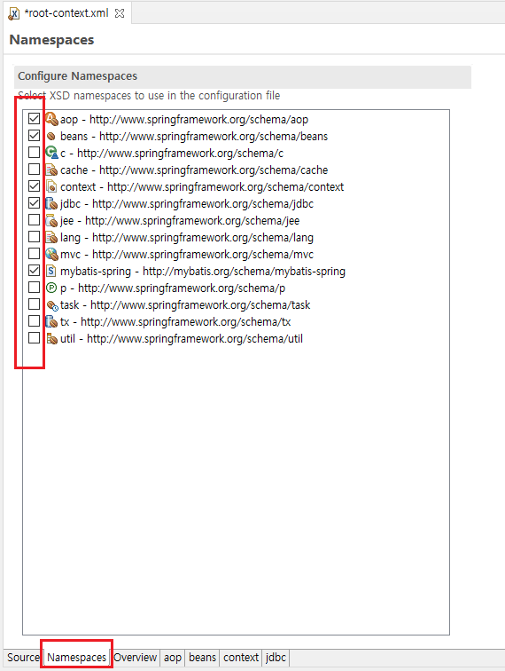

# MyBatis - MySQL 연동하기

## 1.pom.xml

-MyBatis  
-MyBatis-Spring  
-spring-jdbc  
-spring-test  
-MySQL

MyBatis 와 MySQL 연동을 위해 우선 pom.xml 에 위에 적혀 있는
dependency 를 추가해 줘야 한다.

maven 을 활용하여 진행하는 예제이기 때문에 위에 항목들은
메이븐 저장소라는 사이트에서 버전등을 확인 후 추가 할 수있다.

maven repository 링크 : <https://mvnrepository.com/>

```xml
<!-- mySQL 연동 -->
<dependency>
    <groupId>mysql</groupId>
    <artifactId>mysql-connector-java</artifactId>
    <version>8.0.23</version>
</dependency>

<!-- mybatis -->
<dependency>
    <groupId>org.mybatis</groupId>
    <artifactId>mybatis</artifactId>
    <version>3.4.6</version>
</dependency>

<!-- mybatis-spring -->
<dependency>
    <groupId>org.mybatis</groupId>
    <artifactId>mybatis-spring</artifactId>
    <version>1.3.2</version>
</dependency>

<!-- spring-jdbc -->
<dependency>
    <groupId>org.springframework</groupId>
    <artifactId>spring-jdbc</artifactId>
    <version>${org.springframework-version}</version>
</dependency>

<!-- spring-test -->
<dependency>
    <groupId>org.springframework</groupId>
    <artifactId>spring-test</artifactId>
    <version>${org.springframework-version}</version>
</dependency>
```

버전을 나와 같이 할 필요는 없고 각자 맞는 버전으로 사용 하면 된다.

## 2.root-context.xml

다음은 root-context.xml 을 수정해 주어야 한다.
STS를 사용하여 프로젝트를 만들었을 경우 경로는 아래와 같다.

```
/src/main/webapp/WEB-INF/spring/root-context.xml
```



namespaces 를 선택 한후
사진과 같이 체크박스를 체크해 주면 된다.

```xml
<beans xmlns="http://www.springframework.org/schema/beans"
	xmlns:xsi="http://www.w3.org/2001/XMLSchema-instance"
	xmlns:aop="http://www.springframework.org/schema/aop"
	xmlns:context="http://www.springframework.org/schema/context"
	xmlns:jdbc="http://www.springframework.org/schema/jdbc"
	xmlns:mybatis-spring="http://mybatis.org/schema/mybatis-spring"
	xsi:schemaLocation="http://www.springframework.org/schema/jdbc http://www.springframework.org/schema/jdbc/spring-jdbc-4.1.xsd
		http://mybatis.org/schema/mybatis-spring http://mybatis.org/schema/mybatis-spring-1.2.xsd
		http://www.springframework.org/schema/beans https://www.springframework.org/schema/beans/spring-beans.xsd
		http://www.springframework.org/schema/context http://www.springframework.org/schema/context/spring-context-4.1.xsd
		http://www.springframework.org/schema/aop http://www.springframework.org/schema/aop/spring-aop-4.1.xsd">

```

그럼 위와 같이 여러 네임스페이스들이 추가 되있는걸 확인 할 수 있다.

## 3.DataSource 설정하기

DataSource는 JDBC의 커넥션을 처리하는 기능을 가지고 있기 때문에 데이터베이스와 연동 작업에 반드시 필요하다.

root-context.xml 파일에 아래와 같이 DataSource를 설정한다.

```xml
<!-- MySQL 설정 -->
<bean id="dataSource" class="org.springframework.jdbc.datasource.DriverManagerDataSource">
    <property name="driverClassName" value="com.mysql.cj.jdbc.Driver"></property>
    <property name="url" value="jdbc:mysql://ip:port/스키마(DB)명"></property>
    <property name="username" value="DB아이디"></property>
    <property name="password" value="DB패스워드"></property>
</bean>
```

## 4.SqlSessionFactory 설정하기

SqlSessionFactory는 데이터베이스와의 연결과 SQL의 실행에 대한 모든 것을 가진 가장 중요한 객체이다.

root-context.xml 파일에 아래와 같이 SqlSessionFactory를 설정한다.

```xml
<!-- SqlSessionFactory 설정 -->
<bean id="sqlSessionFactory" class="org.mybatis.spring.SqlSessionFactoryBean">
    <property name="dataSource" ref="dataSource"></property>
</bean>
```

## 5.mybatis-config.xml 파일 추가

MyBatis는 스프링설정과 별도로 MyBatis의 설정 기능을 활용할 수 있다.
추후에 MyBatis만의 설정을 위해 추가해 놓도록 한다.

경로는 아래와 같다.

```
/src/main/resources/mybatis-config.xml
```

생성이 됐다면 mybatis-config.xml 파일을 아래와 같이 작성해 놓는다.

```xml
<?xml version="1.0" encoding="UTF-8"?>
<!DOCTYPE configuration PUBLIC "-//mybatis.org//DTD Config 3.0//EN" "http://mybatis.org/dtd/mybatis-3-config.dtd">

<configuration>

</configuration>
```

지금은 config 파일에 설정을 하진 않지만 나중에 사용할 일이 있으므로 스프링이 동작할 때 같이 동작하도록 설정을 해주어야 한다.  
이 작업은 root-context.xml에서 처리한다.

```xml
<!-- SqlSessionFactory 설정 -->
<bean id="sqlSessionFactory" class="org.mybatis.spring.SqlSessionFactoryBean">
    <property name="dataSource" ref="dataSource"></property>
    <property name="configLocation" value="classpath:/mybatis-config.xml"></property>
</bean>
```

SqlSessionFactory 설정 부분에 mybatis-config.xml 을 추가해 준 모습이다.

여기까지 설정을 하고 Junit 과 Spring-test 로 실행을 해보면 MyBatis와 MySQL 이 스프링과 잘 연동 된걸 확인 할 수 있다.
