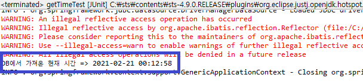

# MyBatis 를 활용해 데이터 이용하기

저번에 포스팅 했던 스프링 MyBatis - MySQL 연동을 한 후에 이어지는 포스팅으로
연동이 끝난 상태에서 실제로 MyBatis를 활용해 MySQL에 있는 데이터를 어떻게 활용하는지에 대한
포스팅이다.

## 1.Mapper.xml 생성

MyBatis는 xml파일에 slq문을 관리 하기 때문에 별도의 slq문을 관리할 xml파일이 필요하다.
그것을 흔히 mapper.xml 이라고 한다.

```
/src/main/resources/mappers/userMapper.xml
```

위에 경로와 같이 resources 밑에 mappers 라는 폴더를 생성한 후 Mapper.xml 파일을 생성하면 된다.  
나같은 경우 userMapper.xml 이라고 생성 했지만 원하는 이름으로 생성한다.

생성된 xml파일에 아래와 같이 내용을 추가한다.

```xml
<?xml version="1.0" encoding="UTF-8"?>
<!DOCTYPE mapper PUBLIC "-//mybatis.org//DTD Mapper 3.0//EN" "http://mybatis.org/dtd/mybatis-3-mapper.dtd">

<mapper namespace="userMapper">

	<select id="getTime" resultType="string">
		select now()
	</select>

</mapper>
```

위 코드는 현재 시간을 알아오기 위한 sql문이며 원하는 데이터를 뽑아오는 sql문을 사용 하면 되지만
위에 적혀 있는 DTD문은 왠만하면 맞춰줘야 한다.
자세한 내용은 <https://mybatis.github.io/mybatis-3/ko/getting-started.html> 을 참고 하면 된다.

namespace 는 java소스 파일에서 xml에 있는 쿼리문을 불러 올때 매칭 시켜주는 역활로 아래 예제와 보면 이해하기가 쉽다.

```java
private static final String namespace = "userMapper";

	@Override
	public String getTime() {
		// TODO Auto-generated method stub
		return sqlSession.selectOne(namespace+".getTime");
	}
```

위 예제와 같이 namespace 에 xml에 지정한 namespace 를 넣어주고
select id="getTime" 의 sql문을 호출 하겠다는 내용이다.

xml에 있는 sql문을 호출 할때 는 원하는 sql문이 있는 xml파일의 namespace.호출할 쿼리ID 로 호출 할 수 있다.

```
selectOne(userMapper.getTime)
```

이런식으로 호출하게 되면 namespace가 userMapper 인 파일 안에 쿼리 아이디가 getTime 인 쿼리문을 실행하게 된다.

MyBatis 의 SqlSession 에는 SQL문을 처리할 수 있는 아래 기능들이 존재한다.

```
<T> T selectOne(String statement, Object parameter)
<E> List<E> selectList(String statement, Object parameter)
<T> Cursor<T> selectCursor(String statement, Object parameter)
<K,V> Map<K,V> selectMap(String statement, Object parameter, String mapKey)
int insert(String statement, Object parameter)
int update(String statement, Object parameter)
int delete(String statement, Object parameter)
```

자세한 내용은 <https://mybatis.github.io/mybatis-3/ko/java-api.html> 이 페이지를 참고 하면 된다.

## 2.root-context.xml 설정 변경

```xml
<!-- SqlSessionFactory 설정 -->
<bean id="sqlSessionFactory" class="org.mybatis.spring.SqlSessionFactoryBean">
    <property name="dataSource" ref="dataSource"></property>
    <property name="configLocation" value="classpath:/mybatis-config.xml"></property>
    <property name="mapperLocations" value="classpath:mappers/**/*Mapper.xml"></property>
</bean>
```

전에 설정해 두었던 SqlSessionFactory 설정 부분에 mapperLocations 가 추가되었다.
내용은 resources 밑에 생성된 mappers 폴더 내에 어떤 폴더이건 관계없이 파일의 이름이 Mapper.xml로 끝나면
자동으로 인식하도록 설정하는 것이다.

그리고 또 하나 설정해줘야 할것은 데이터베이스의 연결을 맺고, 연결을 끊는 작업을 자동으로 해주는
SqlSessionTemplate 설정도 해주어야 한다.

```xml
<!-- SqlSessionTemplate 설정 -->
<bean id="sqlSession" class="org.mybatis.spring.SqlSessionTemplate" destroy-method="clearCache">
    <constructor-arg name="sqlSessionFactory" ref="sqlSessionFactory"></constructor-arg>
</bean>
```

위와 같이 sqlSessionFactory를 생성자로 주입해서 설정해주면 끝이다.

## 3.값이 제대로 넘어오는지 테스트 해보기

지금까지 연동하고 데이터를 뽑아올 준비를 했으면 값이 제대로 넘어오는지 테스트를 해봐야 한다.
현재 시간을 뽑아오는지만 확인하면 되기 때문에 테스트는 JUnit로 간단하게 진행했다.

/src/test 내의 getTimeTest.java 파일을 생성 후 아래와 같이 테스트 코드를 작성한다.

```java
import javax.inject.Inject;

import org.apache.ibatis.session.SqlSession;
import org.junit.Test;
import org.junit.runner.RunWith;
import org.springframework.test.context.ContextConfiguration;
import org.springframework.test.context.junit4.SpringJUnit4ClassRunner;

@RunWith(SpringJUnit4ClassRunner.class)
@ContextConfiguration(locations={"file:src/main/webapp/WEB-INF/spring/**/*.xml"})
public class getTimeTest {

	@Inject
	private SqlSession sqlSession;

	private static final String namespace = "userMapper";

	@Test
	public void testTime() throws Exception {
		System.out.println("DB에서 가져온 현재 시간 => " + sqlSession.selectOne(namespace+".getTime"));
	}
}

```



위와 같이 실행 결과에 DB에서 시간을 잘 가져온걸 확인 할 수 있다.

이건 테스트로 돌린거지만 혹시나 테스트가 아닌 실제 파일에서 실행 할 경우
스프링에서 해당 소스파일이 있는 패키지를 스캔하지 못할 경우 스프링의 빈으로 등록되지 않아
오류가 날 수 있는데 이 부분은 아래와 같이 처리하면 된다.

```xml
<!-- 스프링 빈으로 등록하기 -->
<context:component-scan base-package="해당 소스파일이 있는 풀패키지명" />
```
