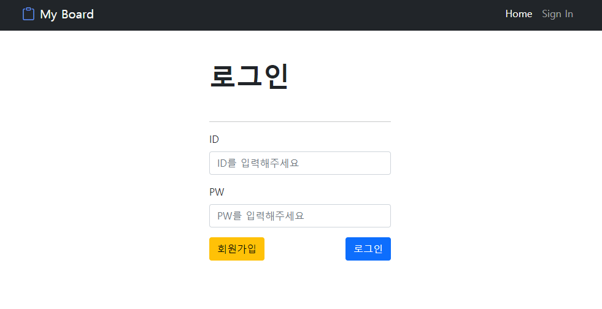
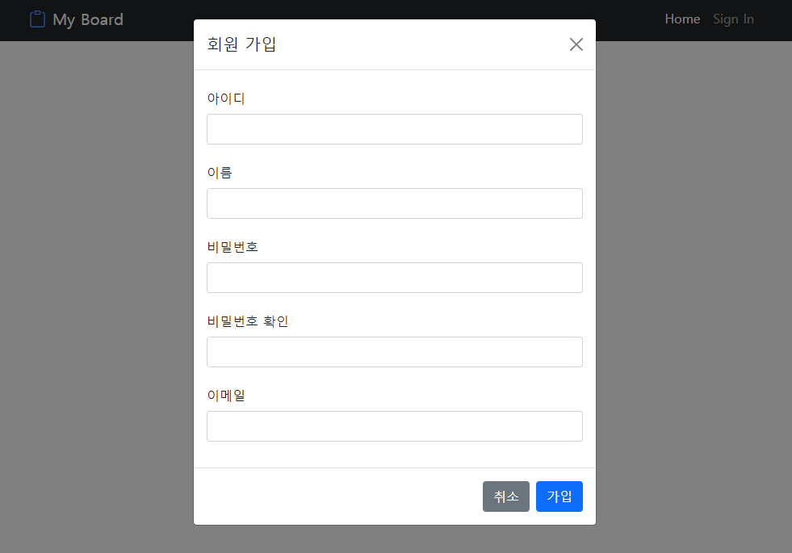
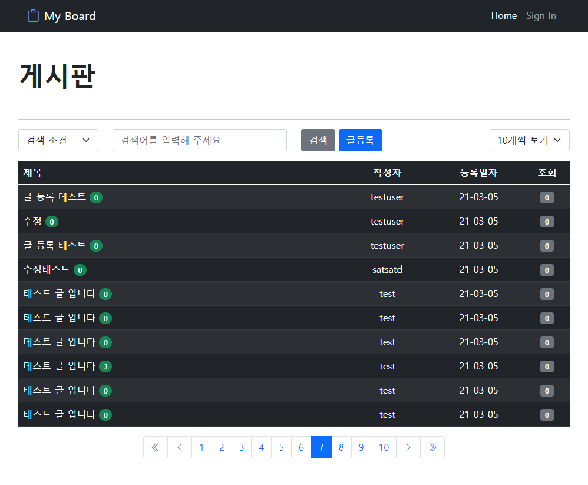
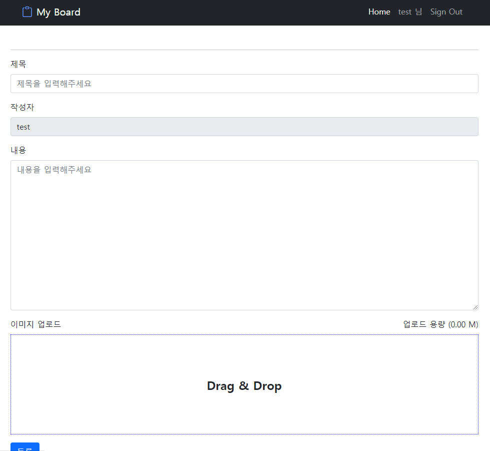
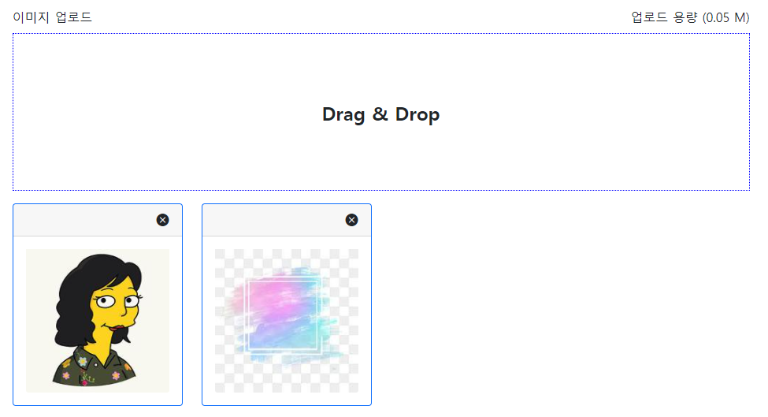
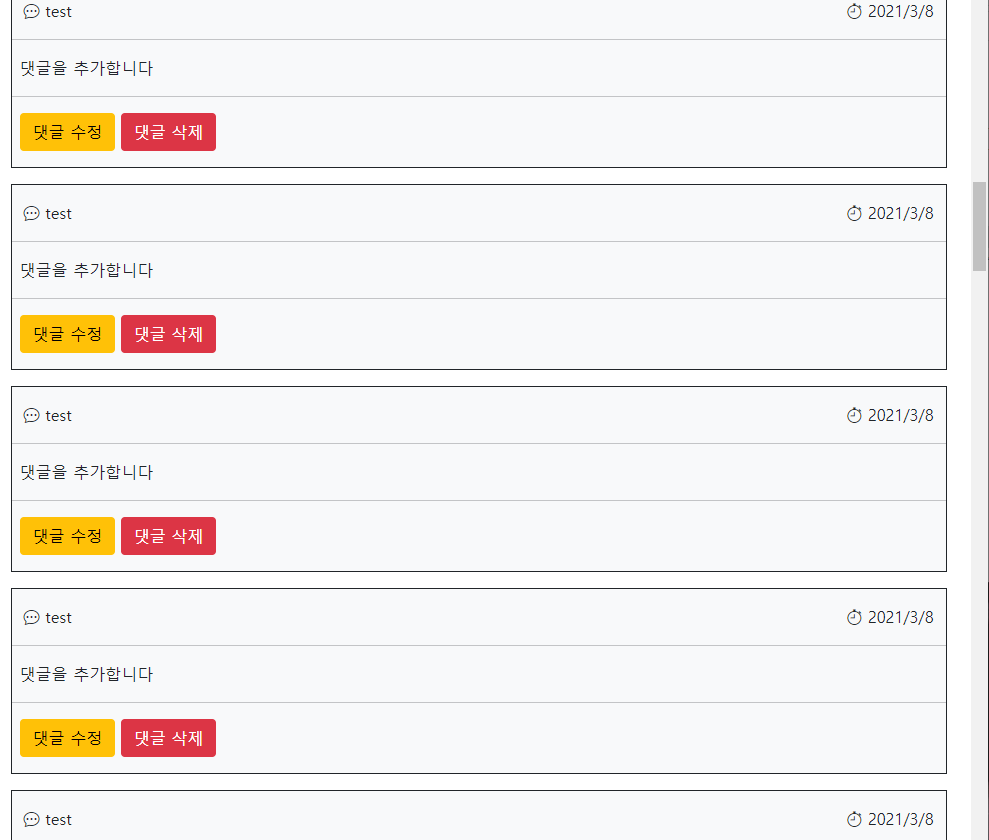

# 자바 게시판

- JAVA 1.8  
- SpringFramework 4.3.12.RELEASE
- Bootstrap 5 
- MySQL 8.0.23
- JavaScript
- Tomcat 9
   
     
GitHub 링크 : <https://github.com/Leeyonghyeong/spring_board>

### (1) 로그인 화면   

로그인은 spring-security 를 통해 password 암호화와    
인증 처리를 진행했습니다.

### (2) 회원 가입

회원 가입은 로그인페이지에서 페이지 변환없이   
bootstrap 에 modal 창을 이용해 구현 했습니다.

### (3) 게시판 화면

게시판 화면에서는 페이징처리와 검색기능 그리고 한 화면에 보여줄   
게시물갯수를 설정할 수 있도록 구현했습니다.   
또 게시물 조회수와 댓글수를 볼 수 있게 했습니다.

### (4) 글 등록 화면

글 등록은 간단하게 제목과 내용 그리고 이미지파일 업로드를 위한    
Drag & Drop 형식으로 다중 파일 업로드를 지원했습니다.

### (5) 파일 업로드

파일 업로드 시 이미지 파일만 업로드 할 수 있으며   
해당 이미지의 썸네일을 만들어 화면에 보여주도록 했습니다.    
올린 파일이 맘에 안들 경우는 삭제 기능도 추가했습니다.

### (6) 댓글 처리

댓글은 기본적으로 10개씩 보여지며   
JavaScript를 활용해 무한 스크롤로 페이징 처리를 했습니다.

## Content
어떤 포트폴리오를 만들까 생각하다 다시 기본부터 하자는 생각으로   
게시판 부터 만들어보자 생각했습니다.   
   
게시판을 만들면서 가장 힘들었던건 아무래도 디자인쪽 감각이 없어서    
많이 힘들었던거 같습니다.   
그래서 bootstrap으로 간단하게 구현해 보았습니다.   

bootstrap5를 사용한 이유는 bootstrap5 부터 jquery 가 포함되어 있지 않아서였습니다. 
요즘 jquery 를 많이 사용 안하는 추세라고 하여 순수 자바스크립트 만으로 진행을 하고자 
bootstrap5 를 사용했습니다.   

로그인과 회원가입 처리는 spring-security를 이용해 인증처리와 암호화를 쉽게 구현할 수 있었습니다.    
여기서 조금 더 다듬으면 소셜 로그인 기능도 추가해 볼 생각입니다.   

소스코드는 GitHub에서 확인 하실 수 있으며   
다음 포트폴리오 계획은 react와 django를 활용해 만들어 보려고 합니다.   