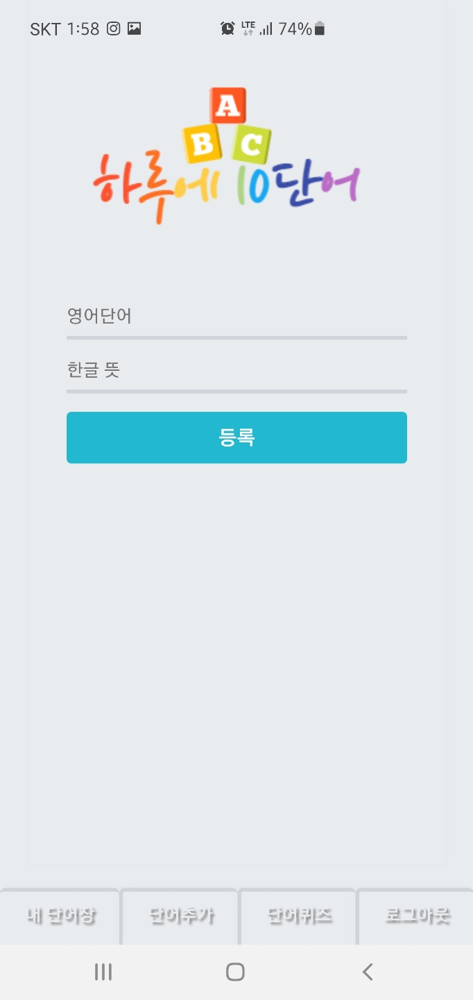
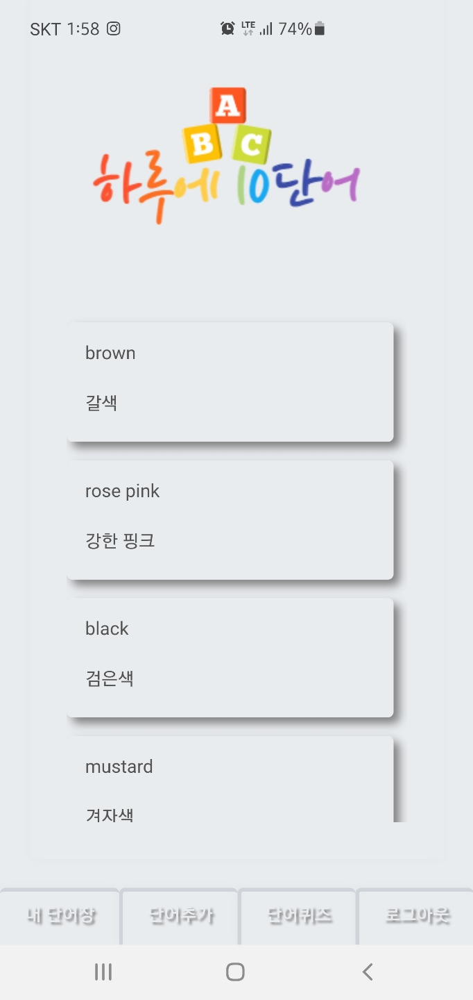
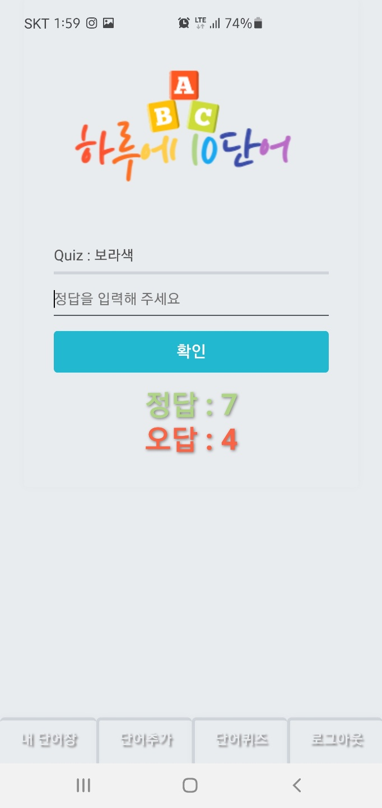

# 하루에 10단어

### 프로젝트 소개

##### java와 react, react-native webview 를 이용해 어플 개발

##### 백엔드는 spring-boot로 프론트는 react로 개발했으며

##### 최종 어플 빌드는 react-native webview 를 이용해 apk파일 생성

##### 마켓에는 미출시

##### spring-boot와 react 연습용으로 만든 어플

##### [APK파일 링크](https://drive.google.com/file/d/1qsV38jyEsFUx2HPuYHC9b5l-3ePvx_gB/view?usp=sharing)

##### [GitHub 링크](https://github.com/Leeyonghyeong/java-react)

##### [포트폴리오 페이지 링크](https://leeyonghyeong.github.io/portFolio/)

##### 단어추가 화면

##### 내단어장 화면

##### 단어퀴즈 화면

---

### 사용 기술

#### 1.BackEnd : Spring-Boot, Security, lombok, JPA, Gradle

#### 2.FrontEnd : React, Redux, SCSS, Hook

#### 3.DB : MySql

#### 4.Server : AWS EC2, nginx, 내장톰캣

---

### 기능 소개

#### 1.회원가입

#### 2.로그인/로그아웃

#### 3.단어 등록

#### 4.등록된 단어 리스트

#### 5.등록된 단어로 단어퀴즈

---
